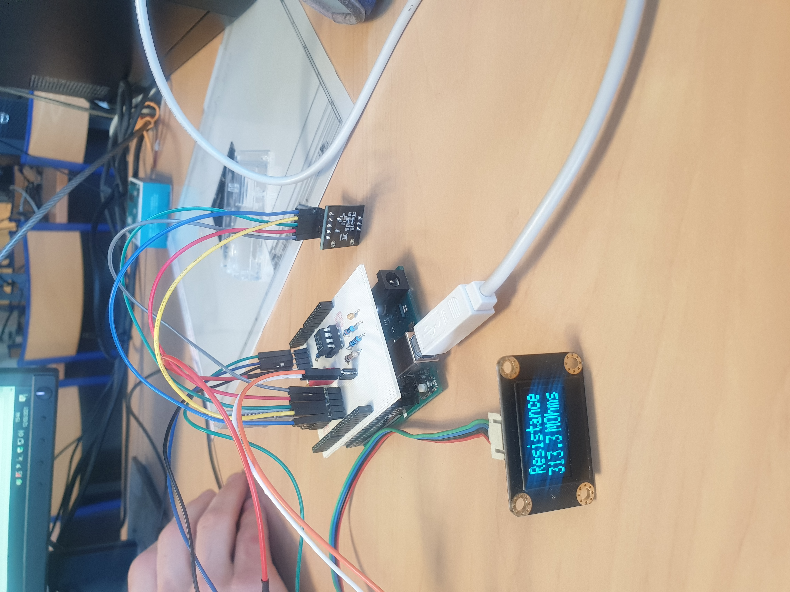

# Fran-ois-Pierre-Project
## Projet capteur graphene
Projet de 4ème année Génie Physique, à l'INSA de Toulouse. Réalisation d'un capteur graphene de déformation. Le but est de mesurer la résistance et la tension du graphene sur une feuille de papier. Pour ce faire nous avons élaborer un shield PCB sur le logiciel Kicad pour placer nos différent composant sur la carte arduino Uno. Nous avons gérer notre capteur grace à un code arduino qui affiche la résistance ou la tension récupéré sur un écran OLED. Notre capteur est relié en bluetooth au téléphone grace à une module HC-05 que nous gérons via une application APK sur My App inventor.

  - [Livrables](#livrables)
  - [Shield](#shield)
  - [Code Arduino Capteur](#code-arduino-capteur)
  - [Application APK](#application-apk)
  - [Code Arduino banc de test](#code-arduino-banc-de-test)
  - [Datasheet](#datasheet)

## Livrables  

- [ ] PCB shield 
- [ ] Code Arduino gérant le capteur 
- [ ] Application APK
- [ ] Programme servo motor
- [ ] Datasheet

## Shield 

Le Shield a été réaliser sur Kicad. Il sert à disposer tout nos composant sur la carte arduino sans utiliser de BradeBoard. Pour réaliser le shield nous avons d'abord duy réaliser la schématic du circuit sur Kicad. Comme la plus part de nos composant n'étais pas disponible sur les librairies de Kicad nous avons crée une libraire (voir Shield) qui contient les empreinte et schématic de tous nos composant.

### Schématique et empreintes

- *Capteur Graphite*

- *HC-05*

- *Encodeur Rotatoire*

- *OLED*

- Une fois les empreintes et les schématiques crées nous avons pu réaliser la schématique complète du circuit;

### PCB routage

- Une fois la schématique finis nous avons put qllouer à chaque composants (résistance, capacité...) une empreinte. Nous avons ensuite visualisé sur l'éditeur de circuit imprimé notre PCB. Nous avons donc organisé nos composant pour qu'il tiennent sur le shield et que nous puissons router correctement et sur chaque Pin les différents modules.

### Visulaisation 3D

- Pour être sur du résultat que nous voulions nous avons pu visulaiser sur Gerber notre shield en 3D avec les composant dessus, à l'execption des module bluetooth, de l'encodeur, du capteur et du LTC qui n'ont pas d'empreinte 3D.

## Code Arduino Capteur

- Le code arduino permet de gérer le capteur. Il récupère la tension du capteur et calcule la résistance. Il affiche sur un écran OLED différent menu en fonction de si l'on appuie ou non sur l'encodeur rotatoir.

## Application APK

- L'application permet de recevoir sur le téléphone la mesure de la résistance et de la tension délivré par le capteur. Nous affichons les deux donnés et nous tra9ons un graphique de la variation de résistance avec une échelle ajustable.
