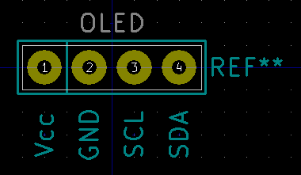

# Francois-Pierre-Project
## Projet capteur graphene
Projet de 4ème année Génie Physique, à l'INSA de Toulouse. Réalisation d'un capteur graphene de déformation. Le but est de mesurer la résistance et la tension du graphene sur une feuille de papier. Pour ce faire nous avons élaborer un capteur accessible à tous et simple d'utilisation sur arduino et App Inventor. Dans ce Git vous trouverez toute les ressources et information nécéssaire pour comprendre le fonctionnement de notre capteur et pouvoir le réaliser chez vous.

## Sommaire

  - [1. Matériel requis](#1-Matériel-requis)
  - [2. Kicad](#2-Kicad)
      - [2.1 Création des empreintes et des composants](#21-Création-des-empreintes-et-des-composants)
      - [2.2 Création du PCB](#22-Création-du-PCB)
  - [3. Code Arduino](#3-code-arduino)
      - [3.1 Librairies utilisées](#31-Librairies-utilisées)
      - [3.2 Le code](#32-Le-code)
  - [4. Application Bluetooth](#4-application-Bluetooth)
  - [5. Banc de test](#5-Banc-de-test)
      - [5.1 Fonctionnement du banc](#51-Fonctionnement-du-banc)
      - [5.2 Code arduino](#52-Code-arduino)
  - [6. Datasheet](#6-datasheet)
  - [7. Contacte](#6-Contacte)

## 1. Matériel requis  

- Smartphone Androide 
- Carte Arduino Uno [info](https://www.arduino-france.com/review/arduino-uno/)
- Une plaque de cuivre pour shield. Ou bien des cables de connexions
- Papier
- Caryon de papier
- Un module HC-05 (gestion du Bluetooth) [ici](https://fr.aliexpress.com/item/32496218488.html?src=google&albch=shopping&acnt=248-630-5778&isdl=y&slnk=&plac=&mtctp=&albbt=Google_7_shopping&aff_platform=google&aff_short_key=UneMJZVf&&albagn=888888&isSmbAutoCall=false&needSmbHouyi=false&albcp=11565796786&albag=115683794594&trgt=800756788306&crea=fr32496218488&netw=u&device=c&albpg=800756788306&albpd=fr32496218488&gclid=CjwKCAjwr_uCBhAFEiwAX8YJgRBUgtCF6S3dou6QC6xu91THwD-LvObxEluNS2bU644OLQE_p05mxxoCGZEQAvD_BwE&gclsrc=aw.ds)
- Un écran OLED [ici](https://www.google.com/aclk?sa=l&ai=DChcSEwjiwND8ltHvAhVc6u0KHTwOD0wYABAGGgJkZw&sig=AOD64_0E9f4FFmKPCGubT07_igBVagq6Cw&ctype=5&q=&ved=2ahUKEwi72sj8ltHvAhUSmRQKHRkPB9IQ9aACegQIARBK&adurl=)
- Un encodeur rotatif [ici](https://www.google.com/aclk?sa=l&ai=DChcSEwi_u8-dl9HvAhXC7e0KHZQrC94YABAEGgJkZw&sig=AOD64_0jWmans1feAKcjE1r1Iod4QknEqw&ctype=5&q=&ved=2ahUKEwi5kcadl9HvAhWl8uAKHZ9SAuUQ9aACegQIARBg&adurl=)
- Deux pince crocodile en cuivre
- Un transistor LTC1050 [ici](https://www.reichelt.com/fr/fr/amplificateurs-op-rationnels-unique-2-5-mhz-dil-8-ltc-1050-cn8-p10921.html) 

## 2. Kicad 

Kicad est un logiciel de conception pour l'électronique. Il permet de créer des schémas de circuit, visualiser des circuits en 3D, associer des empreintes au circuit. Dans notre cas, nous utilisons Kicad pour créer un shield pour notre carte Arduino Uno. Ce shield va nous permettre de monter nos composant directment sur la carte. Toute nos empreintes et plans de notre shield sont disponible dans [notre GIT](https://github.com/MOSH-Insa-Toulouse/Francois-Pierre-Project/tree/main/Shield)  

### 2.1 Création des empreintes et des composants

- Pour réaliser notre shield, nous avons du créer une librairie d'empreinte pour nos composants. En effet ceux ci n'étend pas disponible sur les librairies de Kicad nous avons donc créés des schémas et empreintes pour tous nos modules.

- *Capteur Graphite*

- *HC-05*

- *Encodeur Rotatoire*

- *OLED*

- *LTC1050*

### 2.2 Création du PCB

- Une fois les empreintes et les schématiques crées nous avons pu réaliser la schématique complète du circuit. Dans ce schéma vous pouvez retrouver nos modules ainsi que des composants éléctronique de base.

- *Schéma de notre circuit*

- Une fois la schématique finis nous avons put allouer à chaque composants (résistance, capacité...) une empreinte. Nous avons ensuite visualisé sur l'éditeur de circuit imprimé notre PCB. Nous avons donc organisé nos composant pour qu'il tiennent sur le shield et que nous puissons router correctement et sur chaque pin les différents modules.

- Pour être sur du résultat que nous voulions nous avons pu visulaiser sur Gerber notre shield en 3D avec les composant dessus, à l'execption des module bluetooth, de l'encodeur, du capteur et du LTC qui n'ont pas d'empreinte 3D.

## 3. Code Arduino

### 3.1 Librairies utilisées

- Pour réaliser notre capteur, nous utilisons [trois librairies](https://github.com/MOSH-Insa-Toulouse/Francois-Pierre-Project/tree/main/Libairies%20Arduino). 
- La librairie ["Adafruit_BusIO"](https://github.com/MOSH-Insa-Toulouse/Francois-Pierre-Project/tree/main/Libairies%20Arduino/Adafruit_BusIO) qui permet de gérer le connexions en I2C et SPI
- Les librairies ["Adafruit_GFX_Library"](https://github.com/MOSH-Insa-Toulouse/Francois-Pierre-Project/tree/main/Libairies%20Arduino/Adafruit_GFX_Library) et ["Adafruit_SSD1306"](https://github.com/MOSH-Insa-Toulouse/Francois-Pierre-Project/tree/main/Libairies%20Arduino/Adafruit_SSD1306)qui permet de gérer notre écran OLED.

### 3.2 Le code

- [Le code arduino](https://github.com/MOSH-Insa-Toulouse/Francois-Pierre-Project/tree/main/Capteur_Graphene) permet de gérer le capteur. Il récupère sur la pin analogique A0 la valeur de la tension du capteur. Grace à une analyse du circuit éléctronique, nous pouvons déterminer la résistance en fonction de cette tension. Le code affiche sur un écran OLED différents menus en fonction de si l'on appuie ou non sur l'encodeur rotatoir. Il y a un delay de 5ms entre chaque lecture analogique.

## 4. Application Bluetooth

- [L'application](https://github.com/MOSH-Insa-Toulouse/Francois-Pierre-Project/blob/main/TP5.apk) permet de recevoir sur le téléphone la mesure de la résistance et de la tension délivré par le capteur. Nous affichons les deux donnés et nous traçons un graphique de la variation de résistance avec une échelle ajustable. La carte Arduino et plus précisement le module Bluetooth envoie un octet de donnée au téléphone via les pins TX et RX. Cet otcet contient à la fois des valeurs de résistance et de tension séparés par de ",". Chaque doublet de valeurs est lui séparé par des ";". Notre téléphone reçois donc "49,0.39;35,0.60;70,0.37" avec d'abord la valeur de résistance puis une valeur de tension. Le téléphone sépare donc chaque valeur et les affiches. Notre application traite les données sur un intervalle de 100ms. 

- *Code de l'application qui permet de séparer l'octet reçu et de séparer tension et résistance*

- Notre code a aussi une fonctionnalité qui enlève les variation trop importante de réstistance. En effet lors de nos tests notre téléphone recevait bien les valeurs affiché par le OLED, seulement nous avions aussi des valeurs intanpestives qui ne correspondaient pas à une mesure (entre 1 et 9). Pour pallier à ce problème,nous avons donc décider de ne pas prendre en compte les variations trop importantes.

- Pour finir nous avons rajouté une fonctionalité qui permet à l'utilisateur de zoomer ou dezoomer sur la graphique.

- *Code APK permettant de Rescale le graphique*

- La face avant de notre application permet de choisir un module Bluetooth auquel se connecter (Cadre rouge), puis de régler l'échelle (bleu), de visualiser la variation de résistance (marron), et d'avoir les valeurs de résistance et tension en temps réelle (vert).

- *Face avant de notre application*

## 5. Banc de test

### 5.1 Fonctionnement du banc

- Le banc de test que nous avons imaginé permet de mesurer la déformation du capteur sans avoir à le toucher. il suffit de le poser sur le socle et le cervo moteur vient activer une barre qui va plier la juage de contrainte 

- 
- 

### 5.2 Code arduino

- Le code arduino qui gérent le banc de test permet d'afficher la résistance et la déformation en temps réelle.

## 6. Datasheet

- [La datasheet](https://github.com/MOSH-Insa-Toulouse/Francois-Pierre-Project/blob/main/Datasheet.pdf) rédigé permet de comprendre les différentes caractéristiques de notre capteur. Veuillez la lire avant l'utilisation de celui ci. 

## 7. Contacte

- Pour toute question concernant le capteur, l'application APK, le programme Arduino, le PCB ou pour tout complément d'information veuillez nous contacter par mail :
- Pierre CLARET pclaret@etud.insa-toulouse.fr
- François LEPETIT-AIMONT lepetit-@etud.insa-toulouse.fr
